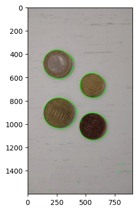

# Práctica 4

## Tabla de contenidos

- [Práctica 4](#práctica-4)
  - [Tabla de contenidos](#tabla-de-contenidos)
  - [Contador de monedas](#contador-de-monedas)
    - [Introducción](#introducción)
      - [Desarrollo](#desarrollo)
      - [Uso del contador](#uso-del-contador)
      - [Demostración](#demostración)
  - [Clasificador de microplásticos](#clasificador-de-microplásticos)
    - [Definiendo estructura de datos y funciones](#definiendo-estructura-de-datos-y-funciones)
    - [Extrayendo los contornos de los microplásticos](#extrayendo-los-contornos-de-los-microplásticos)
      - [Equalizado](#equalizado)
      - [Histograma](#histograma)
      - [Umbralizado](#umbralizado)
      - [Creación de contornos](#creación-de-contornos)
    - [Creando el clasificador](#creando-el-clasificador)
      - [Creando tipos](#creando-tipos)
      - [Creando la herramienta de clasificación](#creando-la-herramienta-de-clasificación)
      - [Trabajando con los datos](#trabajando-con-los-datos)
        - [Balanceando los datos](#balanceando-los-datos)
        - [Extrayendo patrones de los datos](#extrayendo-patrones-de-los-datos)
      - [Analizando el clasificador](#analizando-el-clasificador)


## Contador de monedas

### Introducción
Esta práctica se trata de, dada una imagen de un conjunto de monedas, saber cuanto dinero hay en ella. Para ello se utiliza como referencia una moneda de valor conocido (para tomar su tamaño como referencia), seleccionándola en la imagen.

#### Desarrollo

Utilizando la imagen proporcionada por el profesor como referencia, he implementado todo el algoritmo necesario, y ajustado el parámetro del gap, entre en valor real de la moneda y una pequeña variación respecto a este valor, hasta tomar el valor más alto posible que sea capaz de dar el valor correcto.

Tras este proceso, se ha acabado con un valor de gap de un **0.04**, es decir, un **4%**, quizás muy poco margen, pero las variaciones entre monedas son realmente muy justas.

Hecho esto, se ha probado con otras fotos, dando un resultado incluso mejor del esperado, ya que incluso tomando a las sombras como parte del contorno de la moneda, daba el valor correcto.

#### Uso del contador

1. Aparece una imagen con las monedas y sus contornos definidos.
2. **Debemos seleccionar una moneda de `1€`**
    * Al seleccionar un punto, se pintará de azul
    * Para confirmar la selección debemos pulsar la tecla **ESC**
    * Si no es un punto valido (dentro de un contorno), volverá a aparecer la imagen
    * Si es un punto válido desaparecerá la imagen y continuará el proceso.
3. Se mostrará el resultado de la suma de los valores de las monedas.

#### Demostración

Esta es la imagen que saque yo (y su versión en escala de grises):  
  
Como puede verse no es la mejor de las imágenes, y más adelante veremos que no se detectan bien los contornos.  

Ahora sacamos el histograma, aunque en este caso hemos usado **OTSU**, esta bien saber como es el histograma de la imagen:  
 

Ahora calculamos la versión umbralizada de la imagen, en este caso usando **OTSU** que calcula de forma automática el umbral:  
  
Como vemos, no detecta bien los bordes de la imagen, se vera aún mejor en la siguiente imagen. Una vez calculado el umbral, calculamos los contornos exteriores, dibujando dichos contornos a la imagen original, tenemos lo siguiente:  
  

Pese a no detectar los contornos de forma perfecta, tenemos que el resultado del valor total de las monedas ha sido correcto, presumiblemente debido a la correcta elección del GAP y a que la imagen no ha sido tan mala. (Teniendo por supuesto en cuenta que no existen monedas superpuestas, y otros detalles y/o imperfecciones en las monedas o en la imagen).

## Clasificador de microplásticos

### Definiendo estructura de datos y funciones

El primer paso fué definir una estructura de datos que nos permita trabajar de forma eficiente, en este caso, nos decidimos por el uso de un diccionario de la siguiente forma:
```python
imgs = {
    "sm":{
        "fra": cv2.imread('p2/FRA.png'),
        "pel": cv2.imread('p2/PEl.png'),
        "tar": cv2.imread('p2/TAR.png')
    },
    "bg":{
        "fra": cv2.imread('p2/fragment-03-olympus-10-01-2020.JPG'),
        "pel": cv2.imread('p2/pellet-03-olympus-10-01-2020.JPG'),
        "tar": cv2.imread('p2/tar-03-olympus-10-01-2020.JPG')
    }
}
```

> Donde las imágenes `sm` son las versiones pequeñas y las `bg` son las versiones completas.

También definimos a su vez tres funciones que nos harán la vida mas fácil:
* Una función llamada `applyToAllImgs` y recibe un conjunto de imágenes con la misma estructura antes definida, y una función que aplicarles. Devuelve la misma estructura de datos con las imágenes a las que se les aplicó la función correspondiente.
* Una función llamada `showAll` que recibe un conjunto de imágenes siguiendo la misma estructura y las muestra todas. Se puede hacer uso del parámetro `cmap` por si se quiere mostrar en, por ejemplo, escala de grises (`cmap='gray'`).
* Una función llamada `plotAll` la cual recibe en este caso los datos a graficar.

Tenemos como resultado estas imágenes, con las que trabajaremos:


### Extrayendo los contornos de los microplásticos

#### Equalizado

Aplicaremos un equalizado a todas las imágenes, hemos probado el equalizado estándar, pero el resultado no nos convenció. Por lo que nos decidimos por usar el **CLAHE**, teniendo como resultado las siguientes imágenes:


#### Histograma

Este es el histograma que sacamos de estas imágenes:


#### Umbralizado

Ahora aplicamos un umbralizado, de nuevo, hemos probado el umbralizado **OTSU**, los adaptativos **gausiano** y **mean** y los resultados no han sido satisfactorios. Nos hemos decidido por aplicar un umbralizado estandar con los valores fijos. Hemos elegido los valores usando primero el histograma de las imágenes sin equalizar, y segundo equalizadas, por último, fuimos afinando los valores a mano.  
Hemos terminado con el siguiente resultado:


#### Creación de contornos

Sacamos los contornos externos de las imágenes a partir de la imagen umbralizada, y tras esto, filtramos los contornos por su área. Como los valores de área que se han de usar para filtrar dependen de la escala de la imagen, los hemos decidido a mano probando diferentes valores, hemos acabado con los siguientes valores:

* **Mínimo:** 1200.
* **Máximo:** 60000.

Consiguiendo un resultado bastante bueno, aunque no perfecto, debido a que algunas sombras, se toman como contornos:


### Creando el clasificador

#### Creando tipos

Para facilitar el trabajo, hemos decidido crear una serie de tipos en forma de `namedtuples` que nos facilitarán el trabajo, asi todo el proyecto a la hora de manejar los datos tendrá una interfaz común. Siendo los siguientes (los muestro en formato **Nombre** (campo1, campo2...)):

* **Type** (idx, name)
* **Tester** (type, test)
* **Entry** (type, img, cont)

Además definimos los tipos posibles (que son los tipos de microplásticos en las muestras):  
`types = [Type(0, 'FRA'), Type(1, 'PEL'), Type(2, 'TAR')]`

#### Creando la herramienta de clasificación

En este caso hemos optado hacer del clasificador un sistema un sistema un poco más flexible de lo necesario, convirtiéndolo en una utilidad, con la siguiente interfaz:

* Propiedades:
  * **name**: 
  * **system**: Tiene dos valores posibles `Classifier.SYSTEM_ONE` o `Classifier.SYSTEM_MULTI` (sistema de test único o sistema de tests múltiples)
  * **tester**: Test que se usa para clasificar el tipo (este debe devolver un solo tipo) en caso de usar el sistema de test único.
  * **collision_resolver**: En caso de usar el sistema de resolución por múltiples tests, en caso de que haya varios tipos posibles, resuelve el tipo.
* Métodos:
  * **add_tester**: `(test) -> None`: Añadir un nuevo test para el sistema de resolución múltiples.
  * **delete_tester**: `(test_idx | test_name) -> None`: Eliminar test para el sistema de resolución múltiples.
  * **show**: `() ->  {system, name, test, tests}`: Muestra los datos del clasificador
  * **\_\_call\_\_**: `(entry) -> type`: Le introducimos una entrada y nos devuelve el tipo predicho.


#### Trabajando con los datos

##### Balanceando los datos

El primer paso es balancear los datos, así podremos estimar de mejor manera el desempeño de nuestro clasificador, para lo cual hacemos los siguiente:
* Vemos cuantas muestras tenemos de cada tipo de etiqueta.
* Anotamos el tamaño del conjunto de muestras más pequeño (en este caso **66**)
* Tomamos muestras de forma aleatoria de cada uno de lso conjuntos hasta que todos los conjuntos sean iguales.

Ahora, siguiendo la pauta de usar una interfaz común, convertimos todo el conjunto de datos en una lista de `Entry`; y barajamos la lista.
> Aunque al usar un clasificador sin memoria no tiene una repercusión real el tener el conjunto barajado, hemos optado por tirar de buena *praxis* y barajar el conjunto, dado que el clasificador es fácilmente adaptable para usar un modelo IA.

##### Extrayendo patrones de los datos

Hemos analizado los datos, buscando si las diferentes etiquetas tienen algunas diferencias claras que poder usar a la hora de crear el clasificador, analizamos diferentes parámetros de cada contorno. Hemos usado la mediana a la hora de sacar un valor ya que es menos sensible a los valores extremos. Tenemos lo siguiente:

```txt
# fra
	extent: 0.54
	solidity: 0.81
	equi_diameter: 66.81
	per_div_area: 0.12
	per_div_rad: 9.69
	equi_diameter_div_rad: 1.23

# pel
	extent: 0.60
	solidity: 0.85
	equi_diameter: 101.73
	per_div_area: 0.10
	per_div_rad: 9.89
	equi_diameter_div_rad: 1.36

# tar
	extent: 0.48
	solidity: 0.71
	equi_diameter: 95.02
	per_div_area: 0.15
	per_div_rad: 15.24
	equi_diameter_div_rad: 1.26
```

> * Los datos pueden variar al variar el subconjunto de datos usado debido a la aletoriedad al elegir la muestra con la que trabajar.
> * Hemos optado por elegir solo parámetros geométricos.
> * Hemos creado un clasificador simple a partir de los datos obtenidos.

> Esta comentado el clasificador aleatorio por si se quiere probar (esta comentado)

#### Analizando el clasificador

Una vez creado el clasificador, usamos dos funciones que hemos creado:
* **classifier_analysis** `(classifier, data) -> {accuracy, precision, recall, f1_score, conf_matrix}`
* **classifier_analisis_plot** `{accuracy, precision, recall, f1_score, conf_matrix} -> None`

Y del clasificador que tenemos, con los datos actuales tenemos los siguientes resultados:
```txt
# Datos del clasificador
	Accuracy: 0.60
	Precision: 0.60
	Recall: 0.60
	F1 Score: 0.60
```
