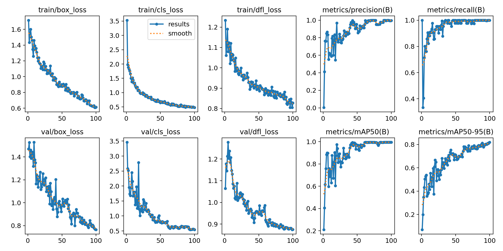

# Práctica 4 - Reconocimiento de matrículas y trackeo de instancias

## Tabla de contenidos

- [Práctica 4 - Reconocimiento de matrículas y trackeo de instancias](#práctica-4---reconocimiento-de-matrículas-y-trackeo-de-instancias)
	- [Tabla de contenidos](#tabla-de-contenidos)
	- [Introducción](#introducción)
	- [Desarrollo](#desarrollo)
		- [Detectar las instancias que buscamos](#detectar-las-instancias-que-buscamos)
		- [Detectar la posición de la matrícula](#detectar-la-posición-de-la-matrícula)
			- [Entrenar el modelo](#entrenar-el-modelo)
			- [Usar el modelo](#usar-el-modelo)
		- [Leer la matrícula](#leer-la-matrícula)
		- [Recopilar los datos](#recopilar-los-datos)


## Introducción

Esta práctica consiste en, mediante el uso de diferentes tecnologías (entre ellas *redes neuronales*), trackear tanto los vehículos como las personas presentes en el vídeo que se nos proporciona. Además, en los vehículos que la posean, leer la matrícula.

## Desarrollo

Haremos uso de un modelo llamado **YOLO** y del OCR llamado **EasyOCR**.

### Detectar las instancias que buscamos

El primer paso es usar el modelo YOLO ya entrenado y usar las etiquetas que queremos para que nos seleccione todas las instancias.

Queremos que nos aparezca en la imagen original una caja que encierre a dicha instancia, asociarle un ID (para ello trackearemos). Asimismo, en el video mostraremos tanto el rectángulo que encierra a la instancia como su identificador y su clase, variando en color para cada instancia.

### Detectar la posición de la matrícula

#### Entrenar el modelo

Como YOLO de serie no detecta matrículas, necesitamos entrenarlo para que sea capaz de detectarlas. En este caso buscaremos un dataset ya existente, en este caso hemos usado este [dataset](https://universe.roboflow.com/zalfon/platerecsystem-jk0bw/dataset/2).

> Por temas del environment que estamos usando, hemos tenido que modificar el archivo de configuración (data.yaml) del dataset, y hemos tenido que poner rutas absolutas a los directorios de las imágenes.

Una vez con el dataset, vamos a entrenar el modelo. Por suerte, YOLO nos facilita mucho este cometido, dado que el sistema se ocupará de todo. Hay que tener en cuenta que este proceso se podría agilizar enormemente siendo poseedor de una **GPU de Nvidia** para poder hacer uso de **CUDA**; dado que no es este mi caso, tendremos que hacer uso de la **CPU** y mucho más tiempo extra.

El comando a ejecutar para que comience el proceso de entrenamiento es el siguiente:
```bash
 yolo detect train model=../yolo11n-license_plate.pt data=data.yaml imgsz=416 batch=4 device=CPU epochs=100
```

Donde `../yolo11n-license_plate.pt` es el modelo a entrenar y `data.yaml` es el archivo de configuración. Hemos optado por ejecutarlo **100 épocas**, de todas formas, el sistema de entrenamiento de YOLO se quedará con la mejor versión del modelo.

> Nótese que en **device** hemos indicado **CPU**, es aquí donde le indicamos al sistema de YOLO que haremos uso de la **CPU**.

Tras el proceso de entrenamiento, vamos al último entrenamiento que hayamos hecho, y miramos los resultados. Podemos mirar imágenes de funciona nuestra IA, con las detecciones predichas respecto a las etiquetadas.

En nuestro caso tenemos estos resultados:


> Además, probando las salidas con el video con el que vamos a trabajar, tenemos resultados muy satisfactorios.

#### Usar el modelo

Una vez detectado lo que queremos, en aquellos que sean vehículos (en nuestro caso las clases 2, 3 y 5), recortamos la caja que los contienen (creando una subimagen que contiene solo la matrícula), y se la pasamos a nuestra segunda IA. Esta nos identificará (en el caso de que la tenga) la posición de la matrícula.

Es importante tener en cuenta que se trata de una red neuronal, por lo que existe la posibilidad de que nos de una respuesta que no tenga sentido, como por ejemplo, posiciones para (x1,y1) y (x2,y2) que no tengan alto o ancho. Por lo que debemos asegurarnos de que no usemos esos datos, al menos no los intentemos mostrar.


### Leer la matrícula

En el caso de que se haya detectado una matrícula, creamos una subimagen que contenga solo lo que consideramos como una matrícula. Esta imagen se la pasaremos al **OCR**, en este caso como ya hemos indicado anteriormente, haremos uso de **EasyOCR**.

Usaremos el método **recognize**, pasándole la imagen. Aprovecharemos también que este método permite pasarle una lista de caracteres válidos mediante el parámetro **allowlist**; como estamos leyendo matrículas, queremos leer tanto letras como números.

> Es importante tener en cuenta que no siempre estará disponible la matrícula completa, asi que muchas veces veremos trozos de esta.  
> Debido a la calidad de imagen y al movimiento, muchas veces no detectará bien lo que esta escrito en la matrícula.

### Recopilar los datos

Por último, recopilaremos los datos.En este caso, buscamos:
* Un video con todos los objetos detectados, con sus IDs.
	* [Video original](https://alumnosulpgc-my.sharepoint.com/:v:/g/personal/nelson_cabrera101_alu_ulpgc_es/ESugWDjtxJVJj-IE5pvwQGUBh12bk5dA7FzRHa7IkBiZRQ?nav=eyJyZWZlcnJhbEluZm8iOnsicmVmZXJyYWxBcHAiOiJPbmVEcml2ZUZvckJ1c2luZXNzIiwicmVmZXJyYWxBcHBQbGF0Zm9ybSI6IldlYiIsInJlZmVycmFsTW9kZSI6InZpZXciLCJyZWZlcnJhbFZpZXciOiJNeUZpbGVzTGlua0NvcHkifX0&e=gaLV6M)
	* [Video output](https://alumnosulpgc-my.sharepoint.com/:v:/g/personal/nelson_cabrera101_alu_ulpgc_es/ETFxHC_JQbxDqKsyuoBFqZwBB7QXcdvLmFj20OEtrOo1jQ?nav=eyJyZWZlcnJhbEluZm8iOnsicmVmZXJyYWxBcHAiOiJPbmVEcml2ZUZvckJ1c2luZXNzIiwicmVmZXJyYWxBcHBQbGF0Zm9ybSI6IldlYiIsInJlZmVycmFsTW9kZSI6InZpZXciLCJyZWZlcnJhbFZpZXciOiJNeUZpbGVzTGlua0NvcHkifX0&e=486hDl<>)
* Un CSV con los datos obtenidos, usaremos el siguiente formato:
```csv
fotograma,tipo_objeto,confianza,identificador_tracking,x1,y1,x2,y2,matrícula_en_su_caso,confianza_matricula,mx1,my1,mx2,my2,texto_matricula
```
Esta en el archivo [output.csv](./output.csv)
* Contar la cantidad de cada clase.

Estas son las instancias de cada clase:
```
# Total de cada clase
	person (0): 18
	bicycle (1): 1
	car (2): 67
	motorbike (3): 3
	aeroplane (4): 0
	bus (5): 1
	train (6): 0
	truck (7): 0
	boat (8): 0
```