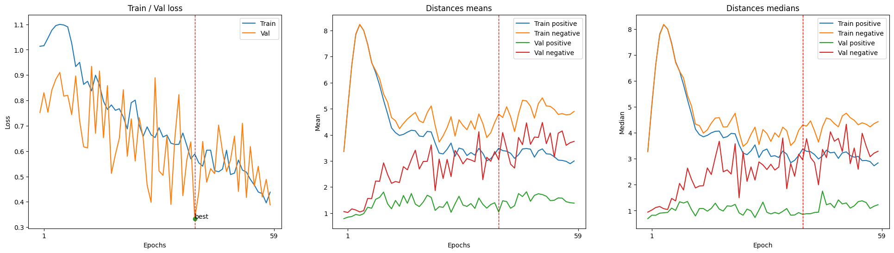
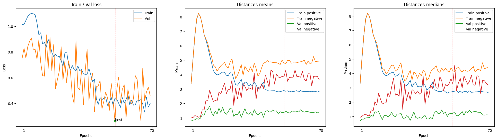

por defecto, `torch.nn.TripletMarginLoss` utiliza `nn.PairwiseDistance` que es la función que nosotros utilizaremos mas adelante para calcular la distancia por nuestra cuenta.


# Proyecto de Visión por computador

## Tabla de contenidos

- [Proyecto de Visión por computador](#proyecto-de-visión-por-computador)
  - [Tabla de contenidos](#tabla-de-contenidos)
  - [Concepto](#concepto)
  - [Estructura del proyecto](#estructura-del-proyecto)
  - [Desarrollo](#desarrollo)
    - [Dataset](#dataset)
      - [Problemas con el dataset](#problemas-con-el-dataset)
      - [Procesamiento de los datos (link)](#procesamiento-de-los-datos-link)
        - [Configuración](#configuración)
    - [Extractor de caras (link)](#extractor-de-caras-link)
      - [Elección del detector](#elección-del-detector)
      - [Extración de las caras](#extración-de-las-caras)
    - [Procesamiento del dataset de las caras extraidas (link)](#procesamiento-del-dataset-de-las-caras-extraidas-link)
    - [Últimos preparativos antes del entrenamiento (link)](#últimos-preparativos-antes-del-entrenamiento-link)
      - [Creamos un Dataset de **pytorch**](#creamos-un-dataset-de-pytorch)
      - [Normalización con media y desviación típica](#normalización-con-media-y-desviación-típica)
      - [Configuración](#configuración-1)
    - [Entrenamiento (link)](#entrenamiento-link)
      - [CUDA](#cuda)
      - [Transformaciones (link)](#transformaciones-link)
        - [Normalize](#normalize)
        - [Data augmentation](#data-augmentation)
      - [Dataset y DatasetLoader](#dataset-y-datasetloader)
      - [Early stopper](#early-stopper)
      - [Modelo (modelo)](#modelo-modelo)
      - [Herramientas de entrenamiento](#herramientas-de-entrenamiento)
        - [Criterion](#criterion)
        - [Optimizer](#optimizer)
        - [Scheduler](#scheduler)
        - [Intentos de entrenamiento](#intentos-de-entrenamiento)
        - [Primer entrenamiento](#primer-entrenamiento)
        - [Segundo entrenamiento a partir del mejor modelo del primer entrenamiento](#segundo-entrenamiento-a-partir-del-mejor-modelo-del-primer-entrenamiento)
    - [Producto final](#producto-final)
  - [Conclusiones](#conclusiones)


## Concepto

Buscamos crear un verificador de identidad mediante imagen facial. Tendremos varios módulos, que se encargaran de cada una de las partes del problema. La idea es que con el input de una imagen saquemos un vector de características que, en la medida de lo posible, pueda identificar a un usuario.

Para lo cual, se seguirán los siguientes pasos:
* Sacar una imagen facial o extraerla de un video.
* Pasar la imagen por un modelo capaz de extraer la cara.
* Normalizar la imagen.
* Pasar la imagen por una red convolucional que se encargue de sacar un vector de características.

Una vez tengamos dicho vector de características, lo podemos almacenar o usar para compararlo con otro vector que tuviésemos previamente.

Esta imagen resume los pasos:


## Estructura del proyecto

Dividiremos las partes del proyecto en:
* **commons**: Aquellos componentes comunes a diferentes partes del código, tales como, clases, tipos de datos, funciones...
* **modules**: Aquellos bloques de código, funciones, clases, que tienen una utilidad en si mismo, y mediante su combinación tendremos el sistema objetivo, asi podemos de forma bien estructurada usar los mismos sistemas en el entrenamiento y en el producto final.
* **procedures**: Procedimientos, pasos a seguir, tareas, pasos necesarios a hacer para llegar a un fin. Aquí se encuentra todo lo referente a la preparación de la CNN.
* **data**: esta carpeta contiene los datasets, no existe en github.
* **.**: Fuera de ningún directorio tenemos:
    * **blaze_face_short_range.tflite**: El modelo que usaremos como extractor de caras.
    * **model.pth**: El modelo que usaremos como extractor del vector de identificación.
    * **requirements.txt**: Este fichero indica las librerías utilizadas, y puede usarse para instalarlas todas en el entorno de forma sencilla.

Como parte del proyecto, vamos a entrenar una **red neuronal convolucional** y los procedimientos necesarios para este fin, se encuentran en el directorio **procedures**. En este paso se ha ido la mayor parte del proyecto.

## Desarrollo

Para explicar el desarrollo, usaremos el mismo orden en el que se estructurará el producto final. Dividiéndolo en los módulos que lo conforman, y dedicando un apartado al producto final terminado.

> Como detalle, todos los procesos tienen una sección con constantes que permiten la configuración de dichos procesos, facilitando así el uso de los procesos y su configuración.

### Dataset

Para entrenar el modelo necesitamos un dataset que por cada una de las personas tenga varias imágenes con las cara de cada una de las personas. Cuanto más variadas sean las personas, mas imágenes de cada persona tenga, y mas personas diferentes tenga, mejor. Esto nos complica bastante encontrar un dataset adecuado. En este caso, se nos ha proporcionado un dataset, del cual usaremos la prueba gratuita. [Link al dataset](https://www.kaggle.com/datasets/tapakah68/selfies-id-images-dataset).

#### Problemas con el dataset

Dependiendo del sistema operativo algunos nombres no se interpretan correctamente (ha sido probado en MacOs y Windows). Además no el **CSV** no enruta correctamente al directorio si tenemos en cuenta los directorios que te indican su origen. Para facilitarnos un poco el uso del dataset, muy a nuestro pesar, hemos de modificar un poco su estructura.

* Hacemos que todas las caras esten correctamente orientadas.
* Renombramos los directorios que indican el origen, dejando solo el nombre de la "raza". Aprovechando así la columna del CSV que indica este dato, y completar la ruta.
* Buscamos en el CSV los nombres que no se interpretan correctamente, y los modificamos. Hacemos lo mismo en los directorios con los identificadores de las personas, haciéndolos coincidir.

Una vez completados estos pasos, debería funcionar perfectamente.

> Para facilitar el manejo de los datasets, tenemos un archivo llamado **commmons/dataset.py** que es el encargado de dar una estructura común a los datasets y sus diferentes versiones, para facilitar la cohesión en el código. Tengamos en cuenta que se trabaja con los datos ya procesados para no hacer el procesamiento multiples veces durante el entrenamiento y optimizar el proceso de entrenamiento del modelo.

#### Procesamiento de los datos ([link](procedures/data_processing.ipynb))

En el directorio **procedures**, encontramos un archivo llamado **data_processing.ipynb**, que será el encargado de procesar el dataset, analizarlo, ver los elementos de cada clase y balancearlos. En este caso nos encontramos que tenemos 15 imágenes de cada persona, por lo que no se necesita balancear. Además adecuaremos los nombres de las columnas a nuestro gusto, y haremos que el path tenga en cuenta el subdirectorio en el que se encuentra cada imagen (como mencionamos en el apartado anterior).

Una vez procesados los datos, se encarga de guardarlos. Además, los carga para ver si todo funciona correctamente.

##### Configuración

Este proceso se usará 2 veces, podemos seleccionar el dataset de entrada y el de salida; como estaba pensado para usarse 2 veces para facilitar dicho uso se prepararon 2 conjuntos de pares de datasets entrada/salida. Los cuales podemos elegir fácilmente con la constante `DATASET_ENV`. Para el proceso actual, tenemos que usar la primera combinación: `DATASET_ENV=0`. El `RANDOM_STATE` se utiliza para hacer pruebas, dando siempre la misma semilla para los procesos aleatorios, es decir, se usa para debuguear. Por tanto, debemos que dejarlo como `RANDOM_STATE=None`.

### Extractor de caras ([link](procedures/extracting_faces.ipynb))

#### Elección del detector

Como detector de caras, y por tanto, lo que usaremos para extraer la parte de la cara de la imagen original, usaremos **mediapipe**. El cual ofrece para este problema concreto (**detección de caras**) varios modelos que se encarguen de la detección. Desgraciadamente, el modelo que seguramente sea el más acertado para este problema no lo han desarrollado todavía, por lo que hemos elegido la que creemos la siguiente mejor aproximación para este problema (**blaze_face_short_range**).

[Todos los modelos de mediapipe disponibles][https://ai.google.dev/edge/mediapipe/solutions/vision/face_detector?hl=es-419]

Una vez elegido el modelo, creamos el módulo **modules/face_extractor.py** que contendrá la clase encargada de gestionar la extracción de las caras.

#### Extración de las caras

Usando el modelo, extraemos todas las caras, guardamos las imágenes, y creando un dataframe con la ruta y el `setid`. Para guardarlo posteriormente como un **CSV** y poder usarlo después.

> En función de si usamos cv2 para abrir las imágenes o el sistema que viene con **mediapipe** obtenemos resultados muy dispares.
> * **mediapipe**: Algunas imágenes se cargan giradas 90º y otras no, además extrae muchas menos caras. (Especialmente fallando en uno de los sujetos)
> * **cv2**: El proceso es más lento.


### Procesamiento del dataset de las caras extraidas ([link](procedures/data_processing.ipynb))

Esta vez procesaremos de la misma manera que en el caso anterior, para balancear y analizar lo que tenemos. Es importante tener en cuenta que para que el proceso se aplique sobre el dataset de las caras extraidas, utilicemos el segundo par de datasets entrada/salida (`DATASET_ENV=1`).

### Últimos preparativos antes del entrenamiento ([link](procedures/train_prevs.ipynb))

Lo primero sera separar el dataset en **3** partes: entrenamiento, validation y tests. Aunque tradicionalmente se hacen en proporciones de 70, 20, 10 respectivamente, en este caso, al tener tan pocos elementos hemos  alterado dichas proporciones para que en el conjunto de test existan al menos 2 elementos de cada tipo.
Comprobamos que lo hemos hecho bien y que no existen colisiones, entre los datasets. Una vez hecho este paso, guardamos cada uno de los datasets (que se resume en guardar un CSV de cada uno de ellos).

#### Creamos un Dataset de **pytorch**

El dataset de **pytorch** (extendiendo la clase Dataset de **pytorch**), necesitamos implementar 2 métodos y el constructor. Vamos a integrar un sistema de **data augmentation** integrado en el propio dataset (pudiendo aplicarle diferentes transformaciones de data augmentation al mismo dataset), y además, transformaciones que se aplicaran a todos los elementos (aquí aplicaremos la normalización).

Necesitamos que el dataset nos devuelva tripletas, con un **ancla** (elemento aleatorio), **positivo** (elemento de la misma categoría que el **ancla**) y un **negativo** (elemento de una categoría diferente al **ancla**). Es importante que el ancla no sea la misma imagen que el positivo ni de la misma categoría que el negativo. 

Aplicamos primero las transformaciones del **data augmentation** y después de la normalización.


#### Normalización con media y desviación típica

Se ha estudiado que la normalización de los datasets ayuda a que los modelos converjan más rápido y sean más precisos. Para hacer esto necesitamos, calcular la media y la desviación de todo el dataset, tras esto la guardamos para aplicarla en la normalización del dataset.

#### Configuración

En cuando al proceso podemos modificar el `DATASET_INPUT`, el `DATASET_OUTPUT`, el tamaño de la imagen que deberá concordar con lo que usaremos luego, el `batchsize` solo se utilizará para el calculo de la media y la desviación típica. Los porcentajes de los splits de los conjuntos de entrenamiento, validación y tests.

### Entrenamiento ([link](procedures/model_training.ipynb))

#### CUDA

Para entrenar, es muy recomendable tener configurado **CUDA** en el dispositivo. Aquí no entraremos en como configurarlo, pero si cabe recalcar la importancia de tenerlo (se ahorra mucho tiempo). En el código del entrenamiendo nos aseguramos de que **CUDA** este funcionando correctamente y además guardaremos el dispositivo del que disponemos en la variable `device`.

#### Transformaciones ([link](modules/img_transforms.py))

Todas se aplican a `PILImages`, por lo que tenemos que convertir lo que tengamos ello, y vamos a trabajar con tensores, por lo que tenemos que usar la transformación `ToTensor` para este fin.

##### Normalize

Para mejorar la precision en el análisis aplicaremos una serie de transformaciones, tanto al dataset como a cualquiera de las imágenes que le pasemos al model. En este caso aplicaremos las siguientes transformaciones:

* **escala de grises**: Así el modelo solo tendrá un canal, esto da grandes beneficios así como simplificar el modelo.
* **resize**:  Ajusta el tamaño de la imagen a la que usa el modelo, en este caso `220 pixeles`.
* **equalizado**: Ecualiza la imagen, esto puede mejorar la precisión, al tener una distribución del histograma uniforme.
* **normalizado**:  Normaliza los valores de la imagen para ajustarse a la media y la desviación típica del conjunto total del dataset.

##### Data augmentation

Para aumentar virtualmente el tamaño del dataset de entrenamiento.

* **rotacion aleatoria**: Rotaciones aleatorias de un máximo de **20º**.
* **rotacion aleatoria vertical**: Con una probabilidad del **80%** para ambos casos.
* **Color jitter**: Modifica valores de brillo y contraste, un **1%** para ambos en este caso.

#### Dataset y DatasetLoader

Creamos los datasets de pytorch para cada uno de los conjuntos (entrenamiento, validación y tests), aplicando la normalización a todos los conjuntos y el data augmentation solo al conjunto de entrenamiento.

En cuanto al Dataloader, simplemente creamos por cada `Dataset` un `DataLoader`. Es importante indicar el `batch_size`, en el caso del conjunto de entrenamiento necesitamos que este activo el barajado y no en los demás conjuntos (por temas de eficiencia) y es recomendable que este activado `drop_last`.

El `batch_size` junto al `learning_rate` uno de los hiperparámetros que mas influencian el entrenamiento, por lo que los configuraremos mediante constantes de configuración.

#### Early stopper

Creamos una clase que se encargará de la parada temprana, más conocida como **early stopping**. En nuestro caso, usará el valor del **loss** del conjunto de **validación** para discernir entre si un modelo es mejor o peor que otro. Mantendrá los pesos del mejor de los modelos que se haya conseguido, y la época (por razones de análisis y para reentrenar).

Le hemos puesto una opción de que avise de si el model actual es el mejor o que muestre el mejor hasta el momento, con sus parámetros. Y como añadido, que ejecute un callback cuando se quiera hacer la parada temprana, en este caso solo se avisará de que se ha ejecutado.

Por último, se puede resetear el contador para poder ejecutar un entrenamiento desde el mejor modelo que se tenía.

#### Modelo ([modelo](modules/Model.py))

Creamos un modelo, en este caso usaremos una** red convolucional** típica con 5 **capas convolucionales**, con **batch normalization** y **maxpool** en cada una de las capas, un **padding** de 3, **kernel** de 7. Seguido de 3 capas **fully connected** con una salida de **128** que será nuestro vector de características. Usaremos **relu** como función de activación. Por último, usaremos un **dropout** de `50%` en las capas 1 y 2 de la **fully connected**.

Creamos el modelo y en el caso de tener varios dispositivos **CUDA** usamos el `DataParallel`.

#### Herramientas de entrenamiento

Ya hemos visto algunas como el `Early Stopper` que hicimos a mano, pero estas herramientas ya están creadas y solo necesitamos configurarlas.

##### Criterion

Se utiliza a la hora de calcular el loss y de generar el backwards, o sea, el aprendizaje del modelo. Como hemos indicado antes usaremos el concepto de **Triplets Loss**, donde se usan 3 elementos: ancla, positivo y negativo.

El ancla es una imagen cualquiera, el positivo es un elemento del mismo tipo que el ancla (pero no el mismo elemento) y el negativo es un elemento de un tipo diferente al ancla. Lo que buscamos es que se minimice la **distancia** entre ancla y negativo, al mismo tiempo que se maximice la **distancia** entre ancla y negativo.

Para ello se necesita una forma de calcular la distancia, usaremos la función por defecto de pytorch para este criterion, `PairwiseDistance`.

##### Optimizer

Sirve para el entrenamiento, se encargará de guardar el estado actual del modelo y actualizrá los parámetros basándose en los gradientes computados. En este caso usaremos `SDG` que es uno de los mas conocidos, configurandolo con los siguientes parámetros:

* **learning_rate**: Este valor es realmente muy importante, tiene un impacto más que reseñable en el entrenamiento. No es fijo, en este caso, y tras varias pruebas, nos hemos quedado con un valor de `0.001`.
* **momentum**: Afecta a la inercia del optimizador, generalmente nos da unas gráficas loss/epoch mas suaves, lo que puede ayudar con el entrenamiento, nos hemos quedado con un `0.95`.
* **weight decay**: Es una técnica de normalización que añade una pequeña penalización, en este caso L2 normalización a todos los pesos a la función de cálculo de loss.

##### Scheduler

Se encarga de gestionar la variación del loss durante el entrenamiento, en este caso usaremos `ReduceLROnPlateau`; cuando no se consigue mejora, se reduce el `learning_rate` en una `factor` de **0.1** en este caso, con una paciencia de **10**.

##### Intentos de entrenamiento

Se han intentado varios ajustes de hiperparámetros, y varias configuraciones del model, del dataset, llegando solo a resultados con un **loss** de **.4**, al aumentar las capas fully connected y otros ajustes de hiperparámetros se llegó a la conclusión de que el problema tiene mucha dimensionalidad, es decir se trata de un problema de mucha complejidad para lo que tenemos actualmente.

Para poder abordar el problema de la forma mas adecuada se necesita un dataset mas completo, y posiblemente una red más compleja, lo que nos dejaría con tiempos de entrenamiento más altos.

##### Primer entrenamiento

Terminamos el entrenamiento en la época **40** con un `val_loss` de `0.334` dandonos unos resultados esperanzadores comparados con los anteriores.



Resultados del conjunto de tests

```txt
Loss 0.4830780029296875
Posit dst:	| mean 1.473170286975801	| median 1.2176315784454346	| std 0.9215030930127397	| min, max 0.19301071763038635, 3.6138923168182373	| diff(min,max) 3.420881599187851
Negat dst:	| mean 3.4036544831469655	| median 3.031758427619934	| std 2.1668109497348556	| min, max 0.455168753862381, 8.081620216369629	| diff(min,max) 7.626451462507248
Diff(max(posit_dst), min(negat_dst)) -3.1587235629558563
```

##### Segundo entrenamiento a partir del mejor modelo del primer entrenamiento

Hacemos un entrenamiento a partir del mejor modelo actual para ver si podemos mejorar los resultados. Y obtenemos que en la época 51 (contando con que empezamos en la 40) conseguimos un `val_loss` de `0.26` siendo el mejor resultado obtenido en todos los entrenamientos y pruebas.



Resultados del conjunto de tests

´´´txt
Loss 0.36033838987350464
Posit dst:	| mean 1.4632612499408424	| median 1.1054602265357971	| std 0.8907289976563053	| min, max 0.2247583419084549, 3.42179274559021	| diff(min,max) 3.197034403681755
Negat dst:	| mean 3.663035959005356	| median 3.885785937309265	| std 2.255472419401447	| min, max 0.4521939754486084, 9.316268920898438	| diff(min,max) 8.864074945449829
Diff(max(posit_dst), min(negat_dst)) -2.9695987701416016
´´´

### Producto final
## Conclusiones