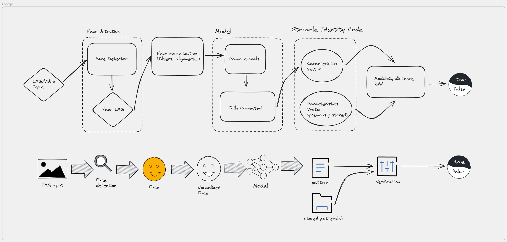

por defecto, `torch.nn.TripletMarginLoss` utiliza `nn.PairwiseDistance` que es la función que nosotros utilizaremos mas adelante para calcular la distancia por nuestra cuenta.

# Proyecto de Visión por computador

## Tabla de contenidos

- [Proyecto de Visión por computador](#proyecto-de-visión-por-computador)
  - [Tabla de contenidos](#tabla-de-contenidos)
  - [Concepto](#concepto)
  - [Estructura del proyecto](#estructura-del-proyecto)
  - [Desarrollo](#desarrollo)
    - [Dataset](#dataset)
      - [Problemas con el dataset](#problemas-con-el-dataset)
      - [Procesamiento de los datos (link)](#procesamiento-de-los-datos-link)
        - [Configuración](#configuración)
    - [Extractor de caras (link)](#extractor-de-caras-link)
      - [Elección del detector](#elección-del-detector)
      - [Extración de las caras](#extración-de-las-caras)
    - [Procesamiento del dataset de las caras extraidas (link)](#procesamiento-del-dataset-de-las-caras-extraidas-link)
    - [Últimos preparativos antes del entrenamiento (link)](#últimos-preparativos-antes-del-entrenamiento-link)
    - [Producto final](#producto-final)
  - [Conclusiones](#conclusiones)

## Concepto

Buscamos crear un verificador de identidad mediante imagen facial. Tendremos varios módulos, que se encargaran de cada una de las partes del problema. La idea es que con el input de una imagen saquemos un vector de características que, en la medida de lo posible, pueda identificar a un usuario.

Para lo cual, se seguirán los siguientes pasos:
* Sacar una imagen facial o extraerla de un video.
* Pasar la imagen por un modelo capaz de extraer la cara.
* Normalizar la imagen.
* Pasar la imagen por una red convolucional que se encargue de sacar un vector de características.

Una vez tengamos dicho vector de características, lo podemos almacenar o usar para compararlo con otro vector que tuviésemos previamente.

Esta imagen resume los pasos:

## Estructura del proyecto

Dividiremos las partes del proyecto en:
* **commons**: Aquellos componentes comunes a diferentes partes del código, tales como, clases, tipos de datos, funciones...
* **modules**: Aquellos bloques de código, funciones, clases, que tienen una utilidad en si mismo, y mediante su combinación tendremos el sistema objetivo, asi podemos de forma bien estructurada usar los mismos sistemas en el entrenamiento y en el producto final.
* **procedures**: Procedimientos, pasos a seguir, tareas, pasos necesarios a hacer para llegar a un fin. Aquí se encuentra todo lo referente a la preparación de la CNN.
* **data**: esta carpeta contiene los datasets, no existe en github.
* **.**: Fuera de ningún directorio tenemos:
    * **blaze_face_short_range.tflite**: El modelo que usaremos como extractor de caras.
    * **model.pth**: El modelo que usaremos como extractor del vector de identificación.
    * **requirements.txt**: Este fichero indica las librerías utilizadas, y puede usarse para instalarlas todas en el entorno de forma sencilla.

Como parte del proyecto, vamos a entrenar una **red neuronal convolucional** y los procedimientos necesarios para este fin, se encuentran en el directorio **procedures**. En este paso se ha ido la mayor parte del proyecto.

## Desarrollo

Para explicar el desarrollo, usaremos el mismo orden en el que se estructurará el producto final. Dividiéndolo en los módulos que lo conforman, y dedicando un apartado al producto final terminado.

> Como detalle, todos los procesos tienen una sección con constantes que permiten la configuración de dichos procesos, facilitando así el uso de los procesos y su configuración.

### Dataset

Para entrenar el modelo necesitamos un dataset que por cada una de las personas tenga varias imágenes con las cara de cada una de las personas. Cuanto más variadas sean las personas, mas imágenes de cada persona tenga, y mas personas diferentes tenga, mejor. Esto nos complica bastante encontrar un dataset adecuado. En este caso, se nos ha proporcionado un dataset, del cual usaremos la prueba gratuita. [Link al dataset](https://www.kaggle.com/datasets/tapakah68/selfies-id-images-dataset).

#### Problemas con el dataset

Dependiendo del sistema operativo algunos nombres no se interpretan correctamente (ha sido probado en MacOs y Windows). Además no el **CSV** no enruta correctamente al directorio si tenemos en cuenta los directorios que te indican su origen. Para facilitarnos un poco el uso del dataset, muy a nuestro pesar, hemos de modificar un poco su estructura.

* Hacemos que todas las caras esten correctamente orientadas.
* Renombramos los directorios que indican el origen, dejando solo el nombre de la "raza". Aprovechando así la columna del CSV que indica este dato, y completar la ruta.
* Buscamos en el CSV los nombres que no se interpretan correctamente, y los modificamos. Hacemos lo mismo en los directorios con los identificadores de las personas, haciéndolos coincidir.

Una vez completados estos pasos, debería funcionar perfectamente.

> Para facilitar el manejo de los datasets, tenemos un archivo llamado **commmons/dataset.py** que es el encargado de dar una estructura común a los datasets y sus diferentes versiones, para facilitar la cohesión en el código. Tengamos en cuenta que se trabaja con los datos ya procesados para no hacer el procesamiento multiples veces durante el entrenamiento y optimizar el proceso de entrenamiento del modelo.

#### Procesamiento de los datos ([link](procedures/data_processing.ipynb))

En el directorio **procedures**, encontramos un archivo llamado **data_processing.ipynb**, que será el encargado de procesar el dataset, analizarlo, ver los elementos de cada clase y balancearlos. En este caso nos encontramos que tenemos 15 imágenes de cada persona, por lo que no se necesita balancear. Además adecuaremos los nombres de las columnas a nuestro gusto, y haremos que el path tenga en cuenta el subdirectorio en el que se encuentra cada imagen (como mencionamos en el apartado anterior).

Una vez procesados los datos, se encarga de guardarlos. Además, los carga para ver si todo funciona correctamente.

##### Configuración

Este proceso se usará 2 veces, podemos seleccionar el dataset de entrada y el de salida; como estaba pensado para usarse 2 veces para facilitar dicho uso se prepararon 2 conjuntos de pares de datasets entrada/salida. Los cuales podemos elegir fácilmente con la constante `DATASET_ENV`. Para el proceso actual, tenemos que usar la primera combinación: `DATASET_ENV=0`. El `RANDOM_STATE` se utiliza para hacer pruebas, dando siempre la misma semilla para los procesos aleatorios, es decir, se usa para debuguear. Por tanto, debemos que dejarlo como `RANDOM_STATE=None`.

### Extractor de caras ([link](procedures/extracting_faces.ipynb))

#### Elección del detector

Como detector de caras, y por tanto, lo que usaremos para extraer la parte de la cara de la imagen original, usaremos **mediapipe**. El cual ofrece para este problema concreto (**detección de caras**) varios modelos que se encarguen de la detección. Desgraciadamente, el modelo que seguramente sea el más acertado para este problema no lo han desarrollado todavía, por lo que hemos elegido la que creemos la siguiente mejor aproximación para este problema (**blaze_face_short_range**).

[Todos los modelos de mediapipe disponibles][https://ai.google.dev/edge/mediapipe/solutions/vision/face_detector?hl=es-419]

Una vez elegido el modelo, creamos el módulo **modules/face_extractor.py** que contendrá la clase encargada de gestionar la extracción de las caras.

#### Extración de las caras

Usando el modelo, extraemos todas las caras, guardamos las imágenes, y creando un dataframe con la ruta y el `setid`. Para guardarlo posteriormente como un **CSV** y poder usarlo después.

> En función de si usamos cv2 para abrir las imágenes o el sistema que viene con **mediapipe** obtenemos resultados muy dispares.
> * **mediapipe**: Algunas imágenes se cargan giradas 90º y otras no, además extrae muchas menos caras. (Especialmente fallando en uno de los sujetos)
> * **cv2**: El proceso es más lento.

### Procesamiento del dataset de las caras extraidas ([link](procedures/data_processing.ipynb))

Esta vez procesaremos de la misma manera que en el caso anterior, para balancear y analizar lo que tenemos. Es importante tener en cuenta que para que el proceso se aplique sobre el dataset de las caras extraidas, utilicemos el segundo par de datasets entrada/salida (`DATASET_ENV=1`).

### Últimos preparativos antes del entrenamiento ([link](procedures/train_prevs.ipynb))

MARK

### Producto final
## Conclusiones